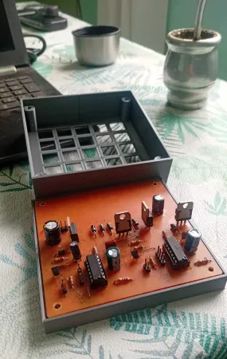

# DCmotorDriver
BDC motor driver based on MOSFET transistors H-bridge

Logical supply:

- 3V to 6V

Bootstrap:

- 10V to 20V
- 0A to 2A (current peak)

Power supply:

- 10V to 80V
- 0A to 3A (5A with dissipation)

## Material list
POWER:

- Driver IR2110 x2
- D FR107 x2
- C100uF electrolytic - 50V x2
- C47nF - 50V x2
- MOSFET IRF540N (or 520) x4
- D FR102 x4
- R10 x4

OTHERS:

- BJT BC635 (to 639) x2
- R10k x6
- C10uF - 250V
- C10uF - 10V
- C100uF - 50V

## Topology
- Driver 1: left-high-side + right-low-side

- Driver 2: right-high-side + left-low-side

## Images

